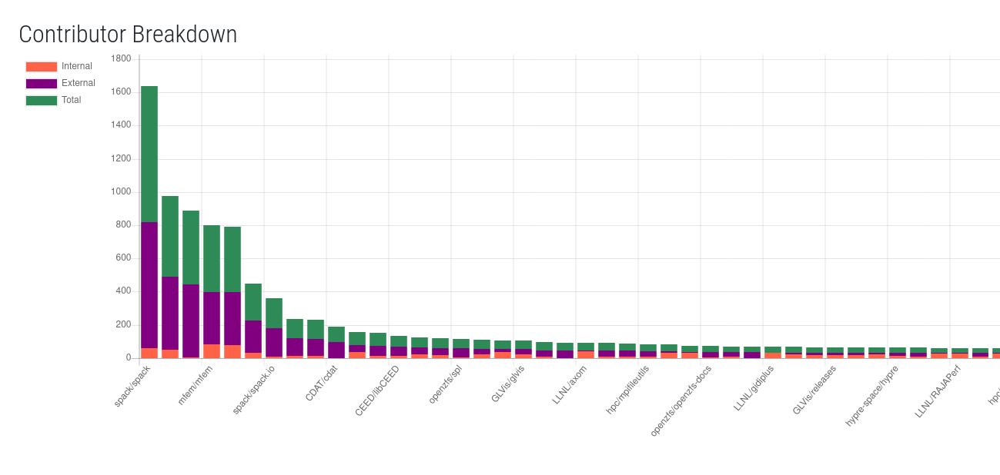

# LLNL Contributors

This is a small project to use a subset of data from [the LLNL open source site](https://llnl.github.io/)
to quickly answer:

 - What is the breakdown of interal vs. external contributors for LLNL open source repositories?
 - Within a repository, where do our contributors come from?
 - Which repositories have opportunity to improve documentation and engagement?
 
If we can pair this with a primary purpose of each repository, we might be able
to say "This tool has a strong use case for the external community but doesn't
seem to be well known."

## Breakdown of contributors

You can see the interface [here](https://vsoch.github.io/llnl-contributors/) to
get a sense of how repositories break down between external and internal contributors,
and read comments for each plot on the page. These plots are updated on a nightly
basis with a [github workflow](.github/workflows/main.yml).

## Contributor Friendliness Analysis

From the above exploration we learn that:

 - We have a few projects that are excelling in attracting external contributors
 - The most "popular" projects are possibly not contributor friendly. 
 - What about the long tail?

The next step must be to look closely at individual projects and make an assessment about
how well they are doing in terms of contributor friendliness. Once we understand
this landscape, we can plan targeted action to engage with external contributors.
 
 - [contributor-friendliness](contributor-friendliness)
 
## TODO

- need a "fresh from the start" way to download users (and label internal/external)
- make this into a GitHub action
- create structure for contributor friendliness survey
